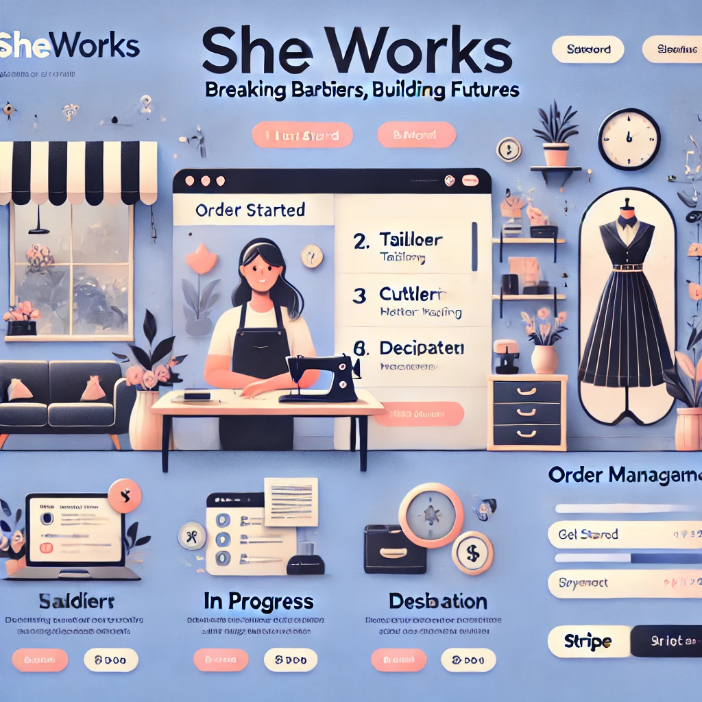

# SHEWorks

## Breaking Barriers, Building Futures

SHEWorks is a web application designed to empower domestic helpers by monetizing their skills in tailoring, teaching, self-portraits, and interior decoration. The platform ensures job security, timely payments, and financial independence through an order-based payout system.

---

 

---

## 📌 Core Features & Implementation

### 🔐 Authentication (Clerk Integration)

- Secure authentication using [Clerk.dev](https://clerk.dev/)
- Supports social logins (Google, Facebook) & email/password authentication
- Role-based authentication:
  - **Workers (Service Providers)**
  - **Customers (Hiring individuals)**
- Session management with Clerk middleware for API routes
  

---

### 🎨 Worker Marketplace & Orders

- Customers can browse service categories:
  ✅ Tailoring
  ✅ Teaching
  ✅ Self-Portraits
  ✅ Interior Decoration
- Workers can create profiles with:
  - Skills & expertise
  - Work portfolio (Image uploads via UploadThing or Cloudinary)
  - Pricing per order
  - Availability status
- Customers can:
  - Place orders & track progress
  - Chat with workers (using Socket.io or Firebase)
  - Rate & review workers after completion
- Order Status System: **Pending → Accepted → In Progress → Completed**
- Order history & invoice downloads

---

### 💰 Secure Payments & Worker Payouts

- **Stripe integration** for secure payments
- Customers prepay, and funds are released upon order completion
- Wallet system for workers to track earnings & request payouts
- Transaction history stored in MongoDB

---

### 📆 Job Security & Fair Pay

- **Schedule Management:** Workers can set work schedules & availability
- **Fair Wage System:** Higher-rated workers get priority for orders
- **Dispute Resolution:** Admin review panel for handling conflicts

---

### 📊 Admin Panel & Dashboard

- **Worker Dashboard:** Earnings, Orders, Customer Messages
- **Customer Dashboard:** Orders, Payments, Favorite Workers
- **Admin Panel:**
  - User management (Approve/reject workers)
  - Order tracking
  - Payment verification

---

## 🚀 Tech Stack

### **Frontend:**

✔ Next.js 14 (App Router) – Modern React framework
✔ Tailwind CSS – Responsive, sleek UI
✔ shadcn/ui – Prebuilt UI components
✔ Framer Motion – Smooth animations

### **Backend:**

✔ Next.js API Routes – Backend logic
✔ MongoDB (Mongoose) – Scalable database
✔ Clerk for Authentication – Secure & easy auth integration
✔ Stripe API – Payment processing
✔ Socket.io or Firebase – Real-time messaging

---

## 🌟 Additional Features

✅ **Mobile-First UI** – Works smoothly on all devices
✅ **Dark Mode Support** – Accessible UI for better readability
✅ **Language Support** – Multi-language options
✅ **Push Notifications** – Alerts for new orders & messages
✅ **Quick Hire Feature** – One-click instant booking

---
